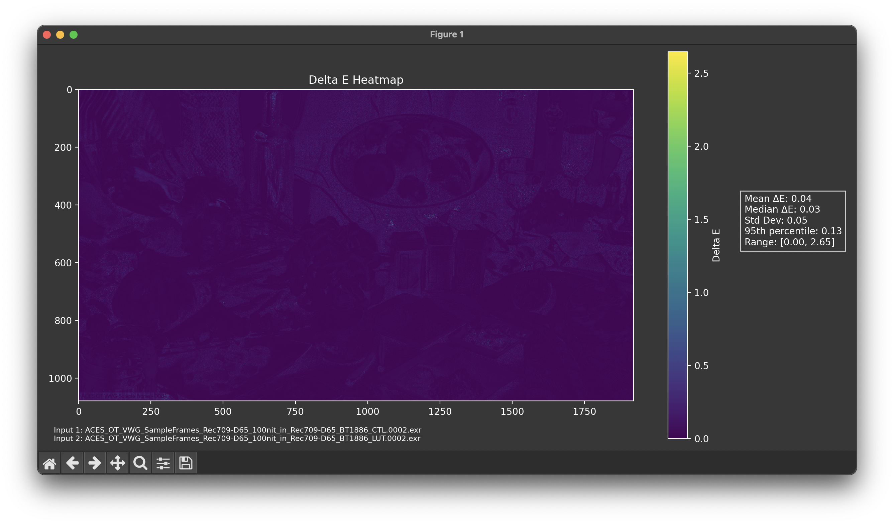

# Output Transform Evaluation Tool

A Python script for computing and visualizing Delta E (ΔE) differences between two EXR images using the ICtCp color space. This tool is particularly useful for evaluating perceptual differences between images in HDR and SDR workflows.

## Features

- **Dual Output Modes**:
  - Save as EXR file with embedded statistics
  - Interactive display mode with heatmap visualization
- **Comprehensive Analysis**:
  - Delta E heatmap generation
  - Statistical metrics (mean, median, std dev, percentiles)
  - On-image statistics overlay
  - Metadata embedding
- **Format Support**:
  - HDR (Rec.2020 color space)
  - SDR (Rec.709 color space)
- **Flexible Processing**:
  - Adjustable luminance scaling for SDR
  - Optional normalization
  - Frame number preservation in output files

## Example Outputs

### EXR Output Mode


### Display Mode


## Installation

1. **Install Python Dependencies**:
```bash
pip install numpy colour-science OpenImageIO Pillow matplotlib
```

2. **OpenImageIO System Installation**:
For macOS:
```bash
brew install openimageio
```

Note: Adjust your PYTHONPATH if needed:
```python
import sys
sys.path.append('/opt/homebrew/Cellar/openimageio/2.5.16.0_2/lib/python3.12/site-packages')
```

## Usage

### Basic Command Structure
```bash
python outputTransformEvalTool.py image1.exr image2.exr [options]
```

### Arguments

#### Required:
- `image1`: Path to first EXR image
- `image2`: Path to second EXR image

#### Optional:
- `-o, --output`: Output path for EXR heatmap
- `-m, --mode`: Processing mode (`SDR` or `HDR`, default: `HDR`)
- `-s, --scaling_factor`: SDR luminance scaling (default: 0.01)
- `--normalize`: Enable [0,1] normalization
- `--display`: Show interactive visualization
- `--export_pq`: Export PQ values file

### Example Commands

1. **Basic EXR Output**:
```bash
python outputTransformEvalTool.py input1.exr input2.exr
```

2. **Interactive Display**:
```bash
python outputTransformEvalTool.py input1.exr input2.exr --display
```

3. **Both Display and Save**:
```bash
python outputTransformEvalTool.py input1.exr input2.exr --display -o output.exr
```

4. **SDR Processing**:
```bash
python outputTransformEvalTool.py input1.exr input2.exr -m SDR -s 0.01
```

## Output Details

### EXR Output Mode
- Generates EXR file with Delta E heatmap
- Preserves frame numbers in output filename
- Embeds statistical metrics in metadata
- Overlays key statistics on image

### Display Mode
- Interactive matplotlib visualization
- Color-coded heatmap with colorbar
- Statistical summary
- Input filename references
- Zoom and pan capabilities
- Dark theme optimized display (#373737 background)

### Statistical Metrics
- Mean Delta E
- Median Delta E
- Standard Deviation
- 95th Percentile
- Min/Max Range

## Understanding the Output

### Delta E Values
- Higher values indicate greater perceptual differences
- Values typically range from 0 to 100
- Values > 1 are generally considered noticeable
- Values > 2 are often considered significant

### Visualization
- Heatmap uses viridis colormap
- Brighter colors indicate larger differences
- Statistical overlay provides quick analysis
- Colorbar shows value scale

## Troubleshooting

### Common Issues
1. **Import Errors**: Verify all dependencies are installed
2. **Path Issues**: Check PYTHONPATH for OpenImageIO
3. **Memory Errors**: Consider processing smaller images first

### Version Requirements
- Python 3.x
- colour-science >= 0.4.3
- OpenImageIO >= 2.0

## Contributing

Contributions are welcome! Please feel free to submit issues or pull requests.

## License

This project is licensed under the MIT License.

## Acknowledgments

- Colour Science Library for colorimetry tools
- OpenImageIO for image handling
- Matplotlib for visualization
- PIL for image processing